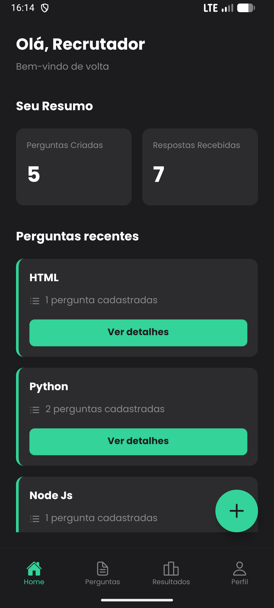
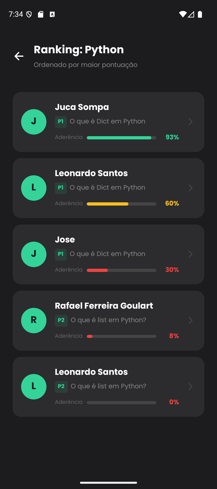
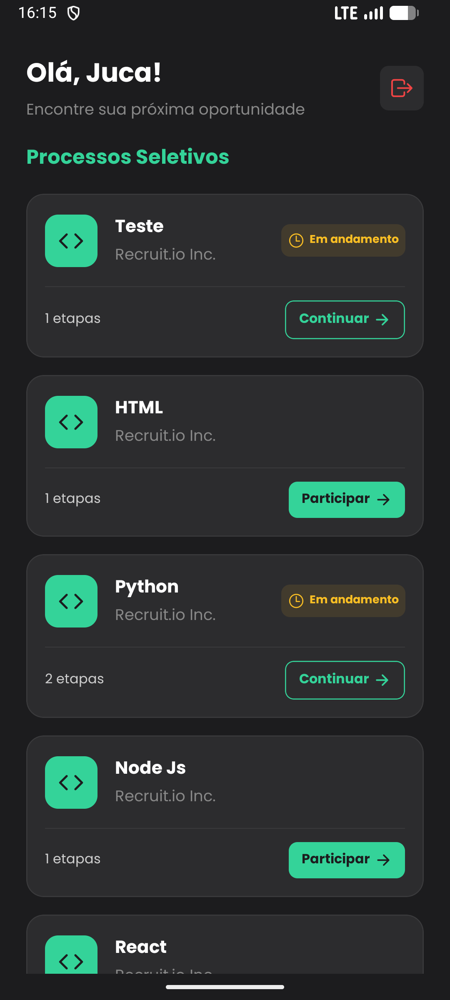
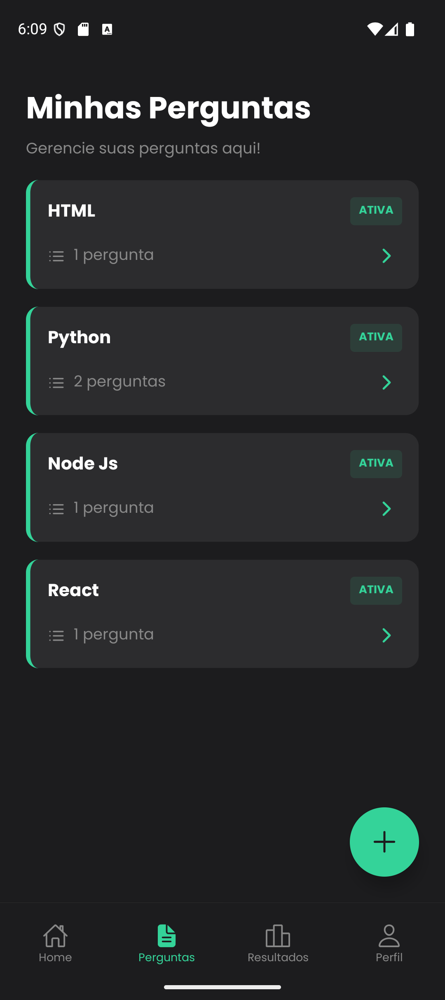
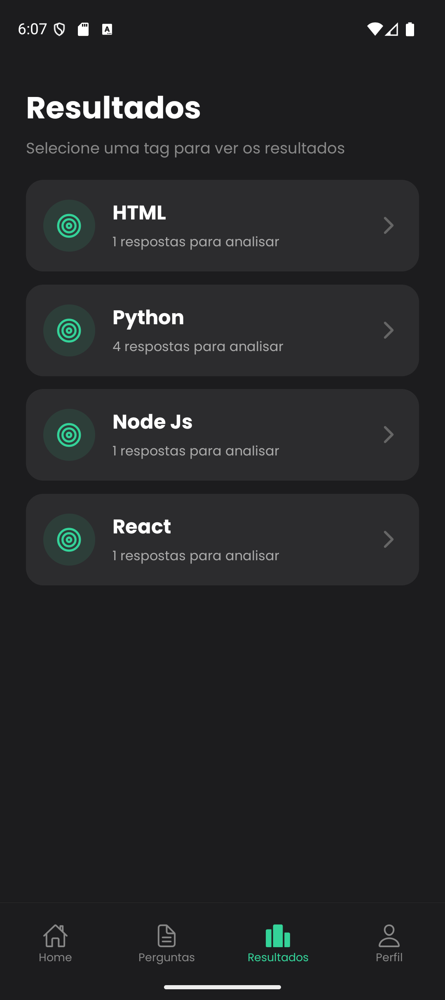

# 🧠 Recruit.io — Front-end (Mobile)

<div align="center">
  
</div>

 

---

## 🚀 Visão geral

**Recruit.io** é uma aplicação móvel (front-end) criada para modernizar a triagem técnica em processos seletivos. Em vez de depender exclusivamente de currículos estáticos, o Recruit.io permite que recrutadores publiquem desafios dissertativos e usem a inteligência artificial para avaliar respostas, gerando um *Fit Score*, feedbacks qualitativos e um ranking automático dos candidatos.

> Público-alvo: recrutadores técnicos, equipes de RH e candidatos que desejam uma avaliação mais justa e baseada em resultados.

---

## ✨ Principais funcionalidades

### Para Recrutadores

* Dashboard com métricas e status das vagas.
* Criação e gestão de vagas com perguntas técnicas (tags e tipos de pergunta).
* Correção automática por IA (Google Gemini 1.5 Flash): nota, pontos fortes e pontos a melhorar.
* Ranking automático de candidatos por aderência.
* Gestão de conteúdo: edição/exclusão de perguntas (com proteção caso já existam respostas).

### Para Candidatos

* Job board com vagas abertas.
* Interface para responder perguntas técnicas de forma dissertativa.
* Feedback imediato: nota e relatório gerado pela IA.
* Progresso visual das perguntas (novas / respondidas).

---

## 🖼 Telas do aplicativo

> As imagens abaixo estão no diretório `./assets/screenshots`.

|      Login |Cadastro                                                   |                     Dashboard Recrutador                     |                        Ranking & IA                        |                      Visão do Candidato                      |
| :---------------------------------------------------------: | :---------------------------------------------------------: | :----------------------------------------------------------: | :--------------------------------------------------------: | :----------------------------------------------------------: |
|  |  |  |  |  |

|                       Minhas Perguntas                       |                           Resultados                          |                           Relatório Gemini                          |
| :----------------------------------------------------------: | :-----------------------------------------------------------: | :-----------------------------------------------------------------: |
|  |  |  |

---

## 🛠 Stack tecnológico

**Front-end (Mobile)**

* Framework: React Native (Expo SDK 52)
* Linguagem: TypeScript
* Navegação: Expo Router (file-based routing)
* Armazenamento local: AsyncStorage (cache de análises e sessão)
* Ícones: @expo/vector-icons (Ionicons / Feather)

---

## 🏗 Estrutura do projeto

O app segue o *Service Layer Pattern* para manter a UI desacoplada da lógica de negócio.

```
app/
├── (auth)/          # Rotas de autenticação (Login, Cadastro)
├── (tabs)/          # Área do Recrutador (Home, Perguntas, Resultados, Perfil)
├── (candidato)/     # Área do Candidato (stack isolada)
├── services/        # Camada de serviços (API)
│   ├── authService.ts
│   ├── perguntaService.ts
│   ├── respostaService.ts
│   └── analiseService.ts
└── components/      # Componentes reutilizáveis
```

---

## ✅ Destaques de implementação

* **File-Based Routing:** rotas definidas pela estrutura de pastas do `app/` (Expo Router).
* **Smart Caching:** análises da IA salvas localmente para reduzir custos de tokens e melhorar performance.
* **Sessão e roles:** redirecionamento automático com base no tipo de usuário (`RECRUITER` ou `USER`).
* **Proteções:** bloqueio de exclusão de perguntas com respostas associadas.

---

## ⚙️ Pré-requisitos

* Node.js (v18+ recomendado)
* npm ou yarn
* Expo CLI (opcional) — `npm install -g expo-cli`
* Android Studio / Emulador iOS (ou Expo Go no dispositivo)

---

## 🧰 Configuração local

1. Clone o repositório

```bash
git clone https://github.com/jhonux/recruit-io.git
cd recruit-io
```

2. Instale dependências

```bash
npm install
# ou
# yarn
```

3. Crie um arquivo de ambiente (`.env`) na raiz com as variáveis necessárias. Exemplo mínimo:

```
API_BASE_URL=https://api.seudominio.com
EXPO_PUBLIC_GEMINI_API_KEY=SEU_KEY_GEMINI
EXPO_PUBLIC_ENV=development
```

> **Observação:** nunca comite chaves privadas. Use secrets do CI ou variáveis do Expo/Google para produção.

4. Execute o app em modo de desenvolvimento

```bash
npx expo start
```

* Abra com o Expo Go (QR code) ou rode no emulador Android/iOS.

---

## 📦 Build e distribuição

* Para gerar um build standalone (Android / iOS) use os comandos do Expo Application Services (EAS) ou `expo build` conforme sua estratégia de publicação.
* Configure as chaves e credenciais no painel do Expo antes de publicar.

---

## 🔒 Segurança e privacidade

* Armazene apenas o necessário no `AsyncStorage` (tokens curtos e cache com expiração).
* Todas as comunicações com o backend devem usar HTTPS.
* Valide permissões e roles no backend (server-side enforcement) — o front-end não deve ser a única camada de segurança.

---

## 🧪 Testes

* Recomenda-se testes unitários para serviços (Jest + Testing Library) e testes e2e com Detox ou Cypress + Appium dependendo da stack escolhida.

---

## 🛠 Scripts úteis

```json
{
  "start": "expo start",
  "android": "expo run:android",
  "ios": "expo run:ios",
  "build": "eas build",
  "lint": "eslint . --ext .ts,.tsx",
  "test": "jest"
}
```

---

## 🤝 Como contribuir

1. Fork o repositório
2. Crie uma branch (`feature/minha-feature`)
3. Faça commits claros e pequenos
4. Abra um Pull Request descrevendo o que foi feito

Considere abrir issues para bugs e melhorias — sempre descrever passos para reproduzir.

---

## 📄 Licença

MIT — consulte o arquivo `LICENSE`.

---

## ✉️ Contato

Jonatas Pereira — jhonux (GitHub)

---

## 🙏 Agradecimentos

* Expo
* React Native
* Google Gemini (integração de IA)

---

> *Notas finais*: este README foi escrito para ser claro, direto e prático — cobrindo instalação, execução, arquitetura e preocupações de segurança.
